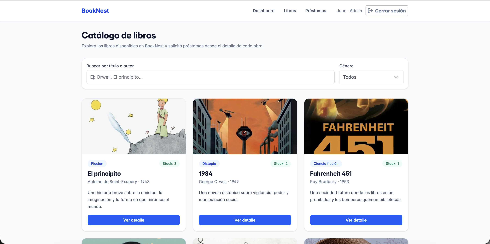

# BookNest

BookNest es una aplicación web desarrollada con React.js para la gestión de libros y préstamos en una biblioteca digital. El proyecto fue realizado como trabajo práctico para el segundo parcial de la materia Plataformas de Desarrollo.

## Integrante

- Luciano Gauna

## Descripción

La aplicación simula un sistema de biblioteca donde los usuarios pueden consultar un catálogo de libros, ver el detalle de cada uno y solicitar préstamos. Además, cuenta con un panel de administración desde donde se pueden gestionar los mismos y las solicitudes de préstamo.

BookNest no utiliza backend ni base de datos real. Los datos iniciales se cargan desde archivos locales JavaScript y luego se persisten en `localStorage` para simular almacenamiento dentro del navegador.

## Temática elegida

La temática elegida es una biblioteca digital.

El sistema permite representar dos partes principales:

- Usuarios comunes que buscan libros y solicitan préstamos.
- Administradores que gestionan el catálogo y controlan el estado de los préstamos.

## Tecnologías utilizadas

- React.js
- Vite
- React Router
- Context API
- Tailwind CSS
- PrimeReact
- PrimeIcons
- localStorage

## Usuarios y roles disponibles

La aplicación cuenta con usuarios simulados.

### Administrador

- Email: `admin@booknest.com`
- Contraseña: `123456`
- Rol: Administrador

Permisos principales:

- Acceder al panel de administración.
- Agregar libros.
- Editar libros.
- Eliminar libros.
- Ver solicitudes de préstamo.
- Aprobar préstamos.
- Rechazar préstamos.
- Marcar préstamos como devueltos.

### Usuario común

- Email: `luciano@booknest.com`
- Contraseña: `123456`
- Rol: Usuario

Permisos principales:

- Ver el catálogo de libros.
- Buscar y filtrar libros por género.
- Ver el detalle de un libro.
- Solicitar préstamos.
- Consultar sus préstamos.
- Cancelar solicitudes pendientes.

## Funcionalidades principales

- Login simulado.
- Logout.
- Rutas protegidas según autenticación.
- Roles de usuario.
- Navbar dinámica según el rol.
- Catálogo de libros.
- Búsqueda de libros por título o autor.
- Filtro por género.
- Vista de detalle de libro.
- Solicitud de préstamo con validaciones.
- Vista de préstamos del usuario.
- Cancelación de préstamos pendientes.
- Panel de administrador.
- Gestión completa de libros:
  - Listar.
  - Agregar.
  - Editar.
  - Eliminar.
- Gestión de préstamos:
  - Aprobar.
  - Rechazar.
  - Marcar como devuelto.
- Persistencia simulada con `localStorage`.
- Interfaz responsive.
- Componentes visuales de PrimeReact.

## Manejo de datos

Los datos iniciales se encuentran en archivos locales dentro de `src/data`:

- `users.js`
- `books.js`
- `loans.js`

Estos archivos funcionan como datos iniciales o seed.

Cuando la aplicación inicia, el contexto de biblioteca revisa si existen datos guardados en `localStorage`. Si existen, utiliza esos datos persistidos. Si no existen, utiliza los arrays iniciales definidos en los archivos locales.

Las operaciones realizadas desde la interfaz, como agregar libros, editar libros, eliminar libros o cambiar estados de préstamos, actualizan el estado de React y también guardan los cambios en `localStorage`.

## Estructura general del proyecto

```txt
src/
├── components/
│   ├── BookCard.jsx
│   ├── BookFormDialog.jsx
│   ├── Layout.jsx
│   ├── LoanRequestForm.jsx
│   ├── LoanStatusTag.jsx
│   ├── Navbar.jsx
│   ├── PageHeader.jsx
│   └── ProtectedRoute.jsx
├── context/
│   ├── AuthContext.jsx
│   ├── LibraryContext.jsx
│   ├── useAuth.jsx
│   └── useLibrary.js
├── data/
│   ├── books.js
│   ├── loans.js
│   └── users.js
├── pages/
│   ├── AdminDashboard.jsx
│   ├── AdminLibros.jsx
│   ├── AdminPrestamos.jsx
│   ├── Catalogo.jsx
│   ├── LibroDetalle.jsx
│   ├── Login.jsx
│   ├── MisPrestamos.jsx
│   └── NotFound.jsx
├── App.jsx
├── index.css
└── main.jsx
```

## Instalación y ejecución

Para instalar las dependencias del proyecto:

```bash
npm install
```

Para ejecutar la aplicación en modo desarrollo:

```bash
npm run dev
```

Luego abrir en el navegador:

```txt
http://localhost:5173
```

## Build de producción

Para generar la versión de producción:

```bash
npm run build
```

## Captura de pantalla



## Deploy

Aplicación publicada en:

```txt
Agregar link del deploy
````

## Entrega

- Repositorio: https://github.com/LucianoGauna/booknest-react
- Deploy: Agregar link del deploy