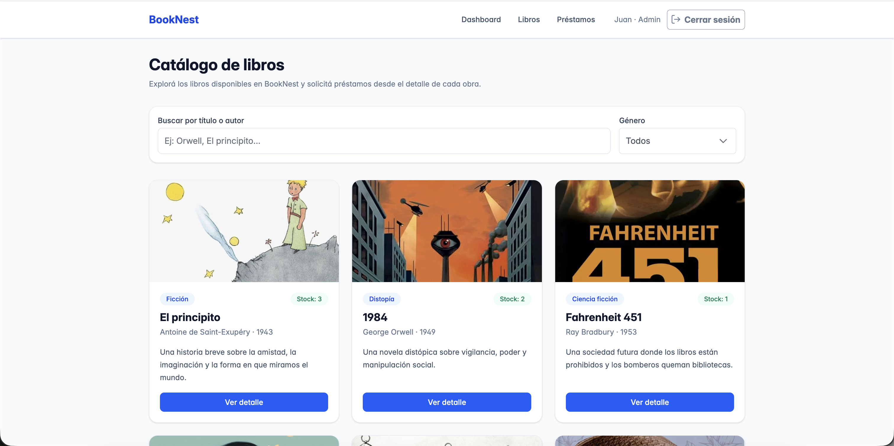

# BookNest

BookNest es una aplicación web full-stack para la gestión de libros y préstamos en una biblioteca digital.

El proyecto está desarrollado con React en el frontend y Node.js + Express en el backend. Utiliza MongoDB Atlas como base de datos, Mongoose para el modelado de datos y JSON Web Token para la autenticación de usuarios.

## Integrante

- Luciano Gauna

## Descripción

La aplicación permite que usuarios comunes consulten un catálogo de libros, vean el detalle de cada obra y soliciten préstamos.

Además, cuenta con un panel de administración desde donde se pueden gestionar los libros del catálogo y administrar las solicitudes de préstamo realizadas por los usuarios.

El sistema trabaja con dos roles principales:

- Usuario común
- Administrador

## Deploy

### Frontend publicado

La aplicación frontend está publicada en Vercel:

```txt
https://booknest-react-vert.vercel.app
```

### Backend publicado

La API backend está publicada en Render:

```txt
https://booknest-backend-lfog.onrender.com
```

### Base de datos

La base de datos utilizada es MongoDB Atlas.

## Tecnologías utilizadas

### Frontend

- React
- Vite
- React Router
- Context API
- Tailwind CSS
- PrimeReact
- PrimeIcons
- Fetch API
- LocalStorage para persistir el token y los datos básicos del usuario autenticado

### Backend

- Node.js
- Express
- MongoDB Atlas
- Mongoose
- JSON Web Token
- bcryptjs
- dotenv
- cors

## Funcionalidades principales

### Autenticación

- Login de usuarios.
- Validación de credenciales contra la base de datos.
- Encriptación de contraseñas con bcryptjs.
- Generación de token JWT.
- Persistencia del token en `localStorage`.
- Rutas protegidas en frontend.
- Rutas protegidas en backend mediante middleware.
- Control de permisos según rol.

### Usuario común

- Ver catálogo de libros.
- Buscar libros por título o autor.
- Filtrar libros por género.
- Ver detalle de un libro.
- Solicitar un préstamo.
- Consultar sus préstamos.
- Cancelar solicitudes pendientes.

### Administrador

- Acceder al panel de administración.
- Ver resumen general del sistema.
- Listar libros.
- Agregar libros.
- Editar libros.
- Eliminar libros.
- Ver solicitudes de préstamo.
- Aprobar préstamos.
- Rechazar préstamos.
- Marcar préstamos como devueltos.

## Entidades principales

El sistema trabaja con tres entidades principales:

### User

Representa a los usuarios del sistema.

Campos principales:

- Nombre
- Email
- Contraseña encriptada
- Rol

### Book

Representa los libros disponibles en la biblioteca.

Campos principales:

- Título
- Autor
- Género
- Año
- Stock
- Descripción
- URL de portada

### Loan

Representa una solicitud de préstamo.

Campos principales:

- Usuario asociado
- Libro asociado
- Fecha de solicitud
- Fecha estimada de devolución
- Estado del préstamo

Los préstamos están relacionados con usuarios y libros mediante referencias de MongoDB.

## Estados de préstamo

Un préstamo puede tener los siguientes estados:

- Pendiente
- Aprobado
- Rechazado
- Devuelto
- Cancelado

Cuando un administrador aprueba un préstamo, el stock del libro disminuye en una unidad.

Cuando un préstamo aprobado se marca como devuelto, cancelado o rechazado, el stock vuelve a incrementarse.

## Usuarios de prueba

### Administrador

```txt
Email: admin@booknest.com
Contraseña: 123456
Rol: admin
```

### Usuario común

```txt
Email: luciano@booknest.com
Contraseña: 123456
Rol: user
```

## Estructura general del proyecto

```txt
booknest-react/
├── backend/
│   ├── config/
│   │   └── database.js
│   ├── controllers/
│   │   ├── authController.js
│   │   ├── bookController.js
│   │   └── loanController.js
│   ├── middleware/
│   │   ├── authMiddleware.js
│   │   └── roleMiddleware.js
│   ├── models/
│   │   ├── Book.js
│   │   ├── Loan.js
│   │   └── User.js
│   ├── routes/
│   │   ├── authRoutes.js
│   │   ├── bookRoutes.js
│   │   └── loanRoutes.js
│   ├── index.js
│   ├── seed.js
│   └── package.json
│
├── src/
│   ├── components/
│   │   ├── BookCard.jsx
│   │   ├── BookFormDialog.jsx
│   │   ├── Layout.jsx
│   │   ├── LoanRequestForm.jsx
│   │   ├── LoanStatusTag.jsx
│   │   ├── Navbar.jsx
│   │   ├── PageHeader.jsx
│   │   └── ProtectedRoute.jsx
│   ├── context/
│   │   ├── AuthContext.jsx
│   │   ├── LibraryContext.jsx
│   │   ├── useAuth.jsx
│   │   └── useLibrary.js
│   ├── pages/
│   │   ├── AdminDashboard.jsx
│   │   ├── AdminLibros.jsx
│   │   ├── AdminPrestamos.jsx
│   │   ├── Catalogo.jsx
│   │   ├── LibroDetalle.jsx
│   │   ├── Login.jsx
│   │   ├── MisPrestamos.jsx
│   │   └── NotFound.jsx
│   ├── services/
│   │   └── api.js
│   ├── App.jsx
│   ├── index.css
│   └── main.jsx
│
├── package.json
├── vercel.json
└── README.md
```

## Instalación y ejecución local

### 1. Clonar el repositorio

```bash
git clone https://github.com/LucianoGauna/booknest-react.git
cd booknest-react
```

### 2. Instalar dependencias del frontend

Desde la raíz del proyecto:

```bash
npm install
```

### 3. Instalar dependencias del backend

```bash
cd backend
npm install
```

## Variables de entorno

### Backend

Crear un archivo `.env` dentro de la carpeta `backend` con las siguientes variables:

```env
PORT=3000
MONGO_URI=URI_DE_MONGODB_ATLAS
JWT_SECRET=CLAVE_SECRETA_JWT
```

> Por seguridad, los valores reales de `MONGO_URI` y `JWT_SECRET` no se incluyen en el repositorio.

### Frontend

Crear un archivo `.env` en la raíz del proyecto:

```env
VITE_API_URL=http://localhost:3000/api
```

Para producción, el frontend utiliza la URL pública del backend publicado en Render:

```env
VITE_API_URL=https://booknest-backend-lfog.onrender.com/api
```

## Ejecutar el proyecto en desarrollo

### Backend

Desde la carpeta `backend`:

```bash
npm run dev
```

El backend se ejecuta en:

```txt
http://localhost:3000
```

### Frontend

Desde la raíz del proyecto:

```bash
npm run dev
```

El frontend se ejecuta en:

```txt
http://localhost:5173
```

## Cargar datos iniciales

Desde la carpeta `backend`, ejecutar:

```bash
npm run seed
```

Este comando crea:

- Usuarios de prueba.
- Libros iniciales.
- Un préstamo inicial.

## Endpoints principales

### Autenticación

```txt
POST /api/auth/login
GET /api/auth/profile
```

### Libros

```txt
GET /api/books
GET /api/books/:id
POST /api/books
PUT /api/books/:id
DELETE /api/books/:id
```

Las operaciones `POST`, `PUT` y `DELETE` requieren token de administrador.

### Préstamos

```txt
GET /api/loans
GET /api/loans/my-loans
GET /api/loans/:id
POST /api/loans
PUT /api/loans/:id
DELETE /api/loans/:id
```

Las rutas de préstamos requieren autenticación. Algunas acciones están restringidas al rol administrador.

## Reglas principales del sistema

- Un usuario puede solicitar un préstamo si el libro tiene stock disponible.
- Una solicitud nueva se crea con estado `Pendiente`.
- Un usuario no puede tener dos préstamos activos del mismo libro al mismo tiempo.
- Se consideran préstamos activos los que están en estado `Pendiente` o `Aprobado`.
- Si un préstamo es rechazado, cancelado o devuelto, el usuario puede volver a solicitar el mismo libro.
- Aprobar un préstamo descuenta una unidad del stock del libro.
- Marcar como devuelto un préstamo aprobado devuelve una unidad al stock del libro.

## Build de producción

Desde la raíz del proyecto:

```bash
npm run build
```

## Repositorio

```txt
https://github.com/LucianoGauna/booknest-react
```

## URLs de entrega

```txt
Repositorio:
https://github.com/LucianoGauna/booknest-react

Frontend:
https://booknest-react-vert.vercel.app

Backend:
https://booknest-backend-lfog.onrender.com

Base de datos:
MongoDB Atlas
```

## Captura de pantalla

